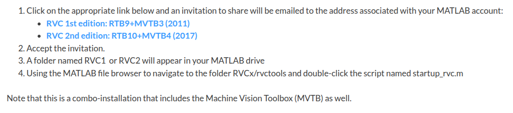
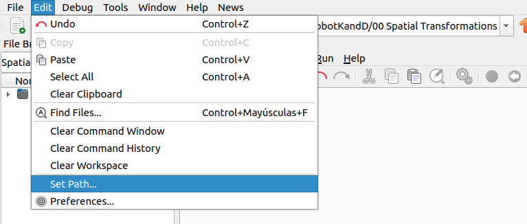
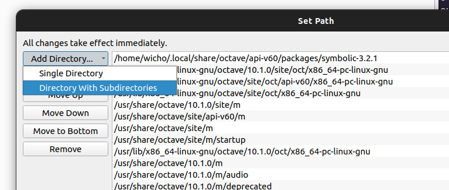
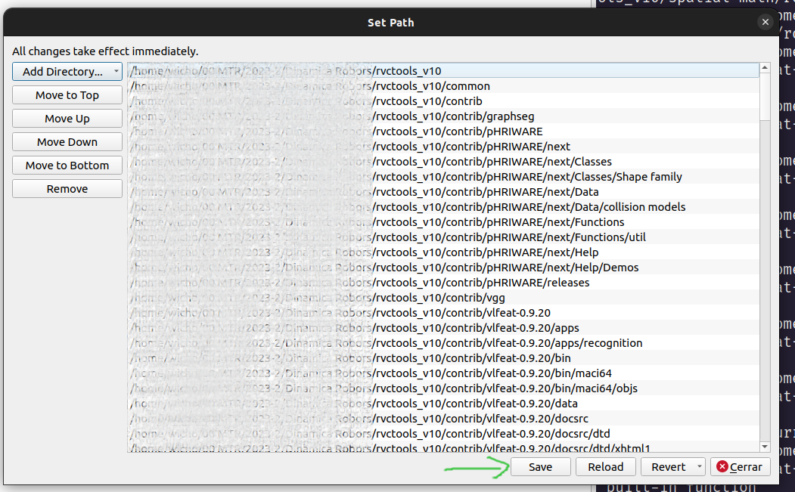

# Software Setup

In this repository, **GNU Octave** will be used as the primary tool for the **implementation and visualization** of the **kinematic and dynamic models** of the serial chains under study. However, **MATLAB** can also be used, as the development is based on the **Peter Corke toolbox**, which is compatible with both platforms and provides a wide range of specialized functions for the analysis and simulation of robotic systems.

The Peter Corke toolbox can be downloaded from [**this page**](https://petercorke.com/toolboxes/robotics-toolbox/).

***
## Steps to install the toolbox
### GNU Octave
Go to the latest version of the toolbox and download the **"rvctools"** folder and unzip it.

Open **GNU Octave** and go to **Edit → Set Path...**

A window will open where you should select **Add Directory → Directory with Subdirectories**.

In the directory explorer, locate the **rvctools** folder and select it. Then, save and close the path window.
