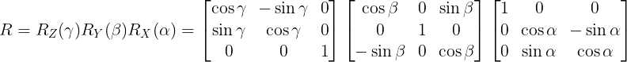

<h1 align="center">Homogeneus Transform Matrix</h1>

To determine the location of an object within a reference frame, it is essential to know both its position and orientation within that frame. To achieve this, a homogeneous transformation matrix is required, as it provides all the necessary information to locate any object within another reference frame.

A homogeneous transformation matrix is composed of four elements: a rotation matrix (orientation), a position vector (translation), a perspective vector, and a scaling factor.

## Orientation

The orientation within a homogeneous transformation matrix is represented by an orthonormal rotation matrix belonging to the special orthogonal group in three dimensions, denoted as SO(3). This matrix provides the necessary information to describe the relative orientation between two three-dimensional reference frames. Mathematically, it can be interpreted as the result of a successive composition of elementary rotations about the coordinate axes. These rotations can follow different conventions, such as ZYZ, ZXZ, or XYZ, with the latter—XYZ sequence—being the most commonly used in robotics and computer vision applications due to its simplicity and the geometric clarity it offers when describing spatial transformations in Cartesian coordinate systems.

### XYZ Rotation (Yaw, Pitch, Roll)

The **XYZ rotation matrix** is one of the most commonly used methods to represent the orientation of an object in three-dimensional space, especially in robotics, computer graphics, and computer vision.

The **XYZ rotation** refers to a sequence of **intrinsic** or **successive rotations** applied in the following order:

1. A rotation around the **X-axis** (roll),
2. followed by a rotation around the **Y-axis** (pitch),
3. and finally a rotation around the **Z-axis** (yaw).

This convention is useful because it allows a complex orientation to be broken down into three simpler angles, commonly known as **Euler angles** (in this case, using the XYZ convention).

---

### Mathematical Form

The XYZ rotation matrix is obtained by multiplying three elementary rotation matrices:

$$\huge R = R_Z(\gamma) \cdot R_Y(\beta) \cdot R_X(\alpha)$$

Where:

- $R_X(\alpha)$ is the rotation about the X-axis,
- $R_Y(\beta)$ is the rotation about the Y-axis,
- $R_Z(\gamma)$ is the rotation about the Z-axis,
- and $\alpha, \beta, \gamma$ are the rotation angles in radians (or degrees, depending on the context).

The individual rotation matrices are:

---

### Key Characteristics

- **Order matters**: The XYZ rotation is **not commutative**—changing the order of rotations results in a different final orientation.
- **Intuitive**: Especially in systems with fixed axes where the object rotates with respect to a global reference frame.
- **Euler Angle Ambiguity**: Like other Euler angle representations, XYZ rotations can suffer from **singularities** or **gimbal lock** (e.g., when two rotation axes align).
- **Widely used in animation and kinematics**: The XYZ sequence is popular in graphics engines and for controlling articulated robotic systems.

---

Would you like to see how the full XYZ rotation matrix is constructed from the three angles, or how it is applied in a robotic arm's forward kinematics?