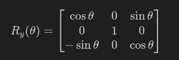

# SPATIAL TRANSFORMATIONS

## Frameworks

In robotics, a **reference frame** (or **coordinate system**) is a set of axes (typically **X**, **Y**, and **Z**) used to define the position and orientation of an object or a set of objects in three-dimensional space. It is essential for describing the movement and interactions of a robot, as it provides a context for measuring the coordinates of points, vectors, and transformations. Two of the most common coordinate systems are **right-handed** and **left-handed**, which mainly differ in the orientation of their axes. These terms come from the **right-hand** and **left-hand** rules, respectively, which define the direction of the axes in a three-dimensional system.

 
<small>Dextrorotative and Levorotative Systems</small>

To generate the image above, you can run the `FramesConvention` script.

## Dextrorotative System
A **right-handed coordinate system** follows the right-hand rule, in which the axes are arranged such that if you point the thumb, index, and middle fingers of your right hand, the three axes (X, Y, Z) will align with the fingers. This system is widely used in robotics, mathematics, and physics applications. 
We consider three unit vectors, **i**, **j**, and **k**, which represent the X, Y, and Z axes, respectively.

The relationship between these vectors is described using the cross product to ensure that the axes follow the correct orientation:

The vector **k** (Z axis) is defined as the cross product of **i** and **j**:

$$\large \mathbf{k} = \mathbf{i} \times \mathbf{j}$$

In general, this cross product ensures that the three vectors are perpendicular to each other and respect the right-hand rule orientation.

## Levorotative System
On the other hand, a **left-handed coordinate system** follows the left-hand rule, where the axes are oriented in the opposite direction. Although less common than the right-handed system, the left-handed system is used in some applications, such as certain 3D graphics systems and specific simulation models.

We consider three unit vectors, i, j, and k, which represent the X, Y, and Z axes, respectively.

In a left-handed coordinate system, the orientation of the axes is such that the Z axis points in the opposite direction compared to a right-handed system. The vector k is defined as the cross product of j and i (note the reversed order):

$$\large \mathbf{k} = \mathbf{j} \times \mathbf{i}$$

This reversed cross product ensures that the three vectors are mutually perpendicular and follow the left-hand rule orientation, where the thumb, index, and middle fingers of the left hand point in the directions of the X, Y, and Z axes, respectively.

These coordinate systems are crucial for defining and controlling the orientation and movement of robots, and the choice between a right-handed or left-handed system can have a significant impact on the design and programming of robotic algorithms.

**Note:** From this point on, all reference frames to be used will follow a right-handed orientation.

***

## Rotation Matrix

In geometry and robotics, a **3D rotation matrix** is a **3×3 orthogonal matrix** used to **rotate vectors or coordinate systems** in three-dimensional space without changing their magnitude—only their orientation.

### 🔧 **Technical Definition:**

A **3D rotation matrix** \( R \) satisfies the following properties:

- $\large R \in \mathbb{R}^{3 \times 3}$
- $\large R^T R = I$
- $\large \det(R) = 1$ 

---

### 📐 **Rotations around the principal axes:**

#### 1. Rotation about the **X-axis**:

 

The following image illustrates the result of rotating a reference frame by 30 degrees about the X-axis, along with the corresponding rotation matrix. Note that the direction of rotation follows the right-hand rule.

 
<small>X rotation by 30 degrees</small>

To generate the image above, you can run the `XRotation` script. I encourage you to modify the rotation angle and observe how the reference frame and its corresponding rotation matrix change.

#### 2. Rotation about the **Y-axis**:

 

The following image illustrates the result of rotating a reference frame by 30 degrees about the Y-axis, along with the corresponding rotation matrix. Note that the direction of rotation follows the right-hand rule.

 
<small>Y rotation by 30 degrees</small>

To generate the image above, you can run the `YRotation` script. I encourage you to modify the rotation angle and observe how the reference frame and its corresponding rotation matrix change.

#### 3. Rotation about the **Z-axis**:

 

The following image illustrates the result of rotating a reference frame by 30 degrees about the Z-axis, along with the corresponding rotation matrix. Note that the direction of rotation follows the right-hand rule.

 
<small>Z rotation by 30 degrees</small>

To generate the image above, you can run the `ZRotation` script. I encourage you to modify the rotation angle and observe how the reference frame and its corresponding rotation matrix change.

---

### 📦 **What is it used for?**

- Transforming vectors from one coordinate system to another.
- Describing the orientation of a rigid body in space.
- In robotics, to define the **orientation of links** or the end-effector.
- In 3D graphics, to rotate models and cameras.

---

### 🧠 **Practical Example:**

If you have a point \( P = [x, y, z]^T \) and want to rotate it around the Z-axis by an angle \( \theta \), you simply compute:

\[
P_{\text{rotated}} = R_z(\theta) \cdot P
\]
